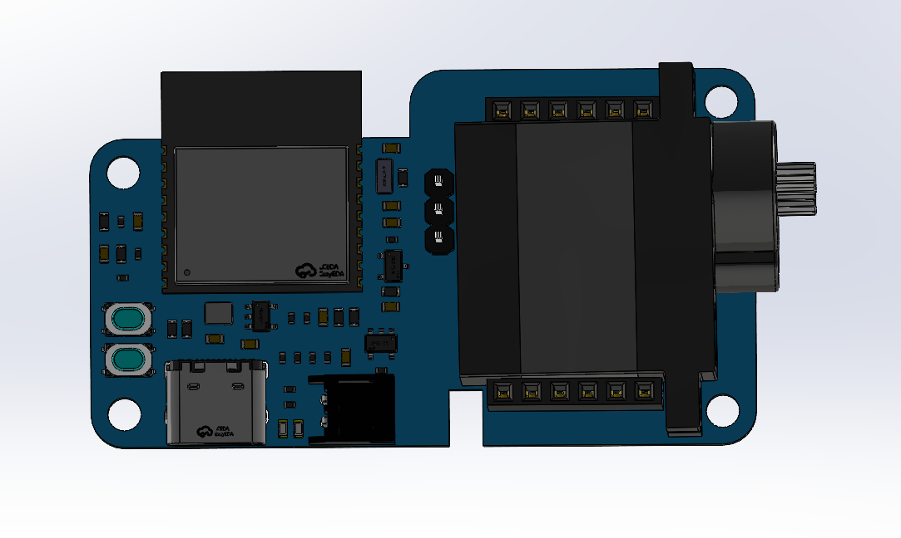

# ESP32-C3 开关熊猫 Switch Panda 
## [中文介绍](./doc/README_CN.md)

The ESP32-C3 Switch Panda is designed to serve lazy individuals, eliminating the need for them to get out of bed to search for the switch. With just a gentle touch on the notification bar, you can enjoy an elegant and convenient lighting control experience. Leave the task of turning off the lights to the Switch Panda, allowing lazy individuals to lie down flatter and more comfortably. This project successfully tackles the significant challenge of turning off the lights before bedtime during the winter season.




## Advantages of the Project

1. **Direct HomeKit Connection**: Enables local network control, supports Siri control and direct control through the notification bar, with fast response. It can also be integrated with the ESP Rainmaker cloud platform for remote control.

2. **Easy Configuration**: Only requires scanning the QR code twice to complete the configuration, allowing you to start using it with ease.

3. **Low Power Consumption Configuration**: Balances fast response and battery life. Equipped with a 2000mAh battery, it can achieve a standby time of approximately 90 days with ESP Rainmaker control alone, and approximately 45 days with HomeKit+ESP Rainmaker.

4. Zero-code Replication

   : The code, hardware, and structure are completely open source.

   - Firmware supports one-click burning, eliminating the need for burning tools or downloading any development environment.
   - All materials are selected with easy-to-solder packages, and as many components as possible can be purchased from reliable sources.
   - Provides purchase links for major components.

5. Supports low battery level alerts and automatic shutdown, ensuring stable functionality.

6. Elegant design with a total material cost of approximately 30 yuan.

## Zero-code Replication

Prerequisites: You have an ESP32-C3 Switch Panda. Other ESP32-C3 development boards can also be used, but you will need to connect the servo motor yourself, otherwise you can only observe the control effect through logs*.

1. Burning:

   1. Click on the image below to jump to the burning page:

   <a href="https://espressif.github.io/esp-launchpad/?flashConfigURL=https://lisir233.github.io/esp_smart_light_controller/config.toml">  </a>

    2. Connect the Switch Panda to your computer.

    3. Press and hold the Reset button and the BOOT button (IO9) on the Switch Panda at the same time, then release the BOOT button first and then the Reset button to force the chip into burning mode.

    4. Click "Connect" and select the corresponding serial port for the Switch Panda to establish a connection. The serial port name is usually similar to `USB JTAG/serial debug unit (COMXX) - Paired`.

    5. Click "Flash" to start burning.

2. Network configuration:

   1. After burning is complete, press the Reset button on the Switch Panda.
   2. Click "Connect" on the webpage and select the serial port to connect to the device.
   3. Click "Console" on the webpage to enter the console page, and click "Reset Device".
   4. Wait a moment, and two QR codes will be displayed on the console, one large and one small. Ignore the small QR code and use the Rainmaker app to scan the large QR code to configure the device. Once completed, you can control the device using the app. At the same time, a small QR code will be generated in the console.
   5. Use the built-in Apple Home app to scan the small QR code to bind the device.

3. Done!

## Compilation and Code Modification

If you want to make modifications based on this code, please follow the steps below to compile:

Prerequisites: ESP-IDF needs to be installed, and the code for ESP Rainmaker and ESP HomeKit SDK needs to be pulled. Links are provided, and if you encounter any issues, please feel free to open an issue in the project.

1. Make sure the above environment is installed and the paths are correctly imported.

2. Clone this repository under the esp-rainmaker/example directory:

   ```
   cd esp-rainmaker/examples/
   git clone git@github.com:lisir233/esp_smart_light_controller.git
   ```

3. Build

   ```
   cd esp_smart_light_controller
   idf.py build
   ```

## Additional Links:

Hardware Open Source Links:

ESP-IDF: [espressif/esp-idf: Espressif IoT Development Framework. Official development framework for Espressif SoCs. (github.com)](https://github.com/espressif/esp-idf)

ESP Rainmaker: [espressif/esp-rainmaker: ESP RainMaker Agent for firmware development (github.com)](https://github.com/espressif/esp-rainmaker)

ESP HomeKit SDK: [espressif/esp-homekit-sdk (github.com)](https://github.com/espressif/esp-homekit-sdk)

## F&Q

- Burning failure:
  - Make sure the battery is connected during burning.
  - Check if the computer recognizes that the device is connected. If not, check if the hardware is soldered correctly and ensure that the selected data cable is capable of data transmission.