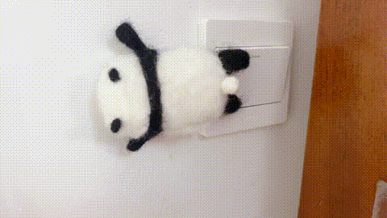

# ESP32-C3 开关熊猫

ESP32-C3 开关熊猫设计聚焦为懒人服务，让懒人不再需要翻身下床找开关，只需下拉通知栏轻轻一按，就能享受到优雅而便捷的灯光控制体验，开关这小事，交给熊猫用脚做吧，懒人应该躺的更平更舒服。该项目基本攻克了冬日睡前需要关灯的重大难题。



## 项目优点

1. **直连Homekit**，实现局域网控制，支持Siri控制和通知栏直接控制,响应迅速，可以接入ESP Rainmaker云平台，实现远程控制。
2. **易于配置**：仅需两次扫码即可完成配置，就可以愉快的使用啦。
3. **低功耗配置**，兼顾响应快速和续航，搭配2000mAh电池，单纯使用ESP Rainmaker控制待机续航约90天，HomeKit+ESP Rainmaker待机续航约为45天。
4. **超易复刻**：代码和硬件和结构完全开源
   - 固件支持一键烧录，无需烧录工具，无需下载任何开发环境。
   - 所有的物料都选择了易于焊接的封装，且尽量选用了立创基础库可贴的元器件。
   - 提供主要元器件购买链接
5. 支持电池低电量报警和自动关机，功能稳定。
6. 外形设计优雅，整机物料成本约30元。

## 零代码复刻

先决条件：有一个 ESP32-C3开关熊猫。使用其他ESP32-C3开发板也可，但需要自己接舵机，不然只能用LOG来观察控制效果了*。

1. 烧录

   1. 点击下方图片跳转烧录页面：

   <a href="https://espressif.github.io/esp-launchpad/?flashConfigURL=https://lisir233.github.io/esp_smart_light_controller/config.toml">
       
   </a>

   ​	2.将开关熊猫连接到电脑。

   ​	3.同时按住开关熊猫上的复位键和BOOT键（IO9），然后先松开BOOT键，再松开复位键，强制芯片进入烧录模式。

   ​	4.点击connect并选择开关熊猫对应的串口进行连接，串口名通常类似于`USB JTAG/serial debug unit (COMXX) - 已配对`

   ​	5.点击Flash开始烧录。

2. 配网：

   1. 烧录完成后，点击开关熊猫上的复位键。
   2. 网页上点击connect并选择连接该设备对应的串口。
   3. 网页上点击Console，进入控制台页面，点击Reset Device。
   4. 稍等片刻控制台上会显示两个二维码，一个大一个小，忽略小的二维码，首先使用Rainmaker APP扫描大的二维码对设备进行配网。完成后在APP上即可控制设备。同时控制台会新生成一个小的二维码。
   5. 使用苹果自带的家庭APP扫描小的二维码对设备进行绑定。

3. 完成！

   [^注]: ESP3232-C3模组的flash必须大于等于4M

## 编译和修改代码

如果想在本代码基础上进行二次修改，请按如下流程进行编译：

先决条件：需要安装ESP-IDF,并拉取ESP-Rainmaker和ESP-HomeKit-SDK的代码，提供了链接，如果遇到问题欢迎在项目中提Issue。

1. 确保上述环境已经安装并正确导入路径：

2. 在esp-rainmaker/example目录下克隆本仓库代码：

   ```
   cd esp-rainmaker/examples/
   git clone git@github.com:lisir233/esp_smart_light_controller.git
   ```

3. 编译

   ```
   cd esp_smart_light_controller
   idf.py build
   ```

​	

## 附加链接：

硬件开源链接：

ESP_IDF：[espressif/esp-idf: Espressif IoT Development Framework. Official development framework for Espressif SoCs. (github.com)](https://github.com/espressif/esp-idf)

ESP_Rainmaker：[espressif/esp-rainmaker: ESP RainMaker Agent for firmware development (github.com)](https://github.com/espressif/esp-rainmaker)

ESP_HomeKit-SDK:[espressif/esp-homekit-sdk (github.com)](https://github.com/espressif/esp-homekit-sdk)

## F&Q

- 烧录失败：

  - 烧录时需要连接电池。
  - 检查电脑上是否识别到了设备插入，如果没有，请检查硬件是否焊接正常，同时确保所选用的数据线是可用于数据传输的数据线。

